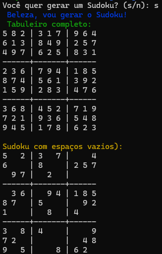

# Sudoku Terminal em Go 🚀

Pequeno projetinho em Go(brincando com terminal) que:

- Gera um tabuleiro completo de Sudoku (9x9)
- Remove números para criar um puzzle
- Usa cores no terminal
- Usei 0 como espaço vazio e pintei de preto 😎



## Como rodar

```bash
go run main.go
